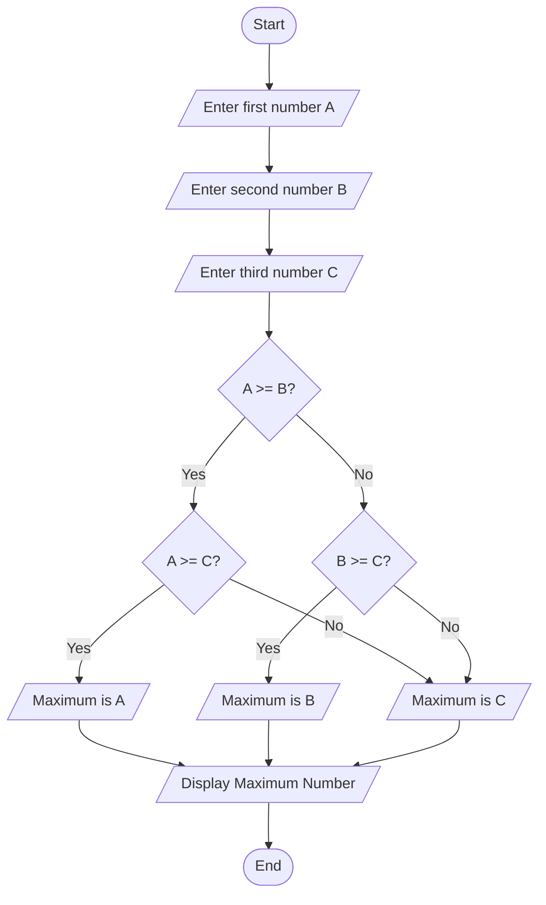
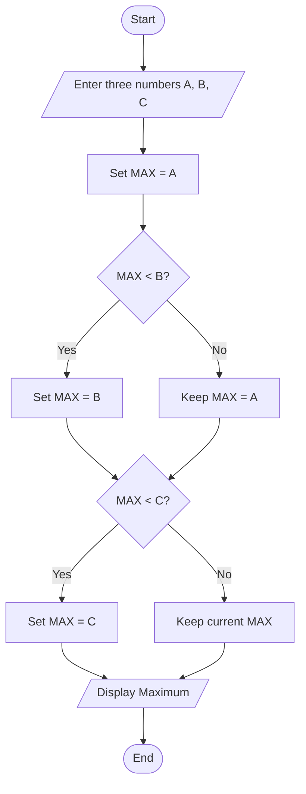
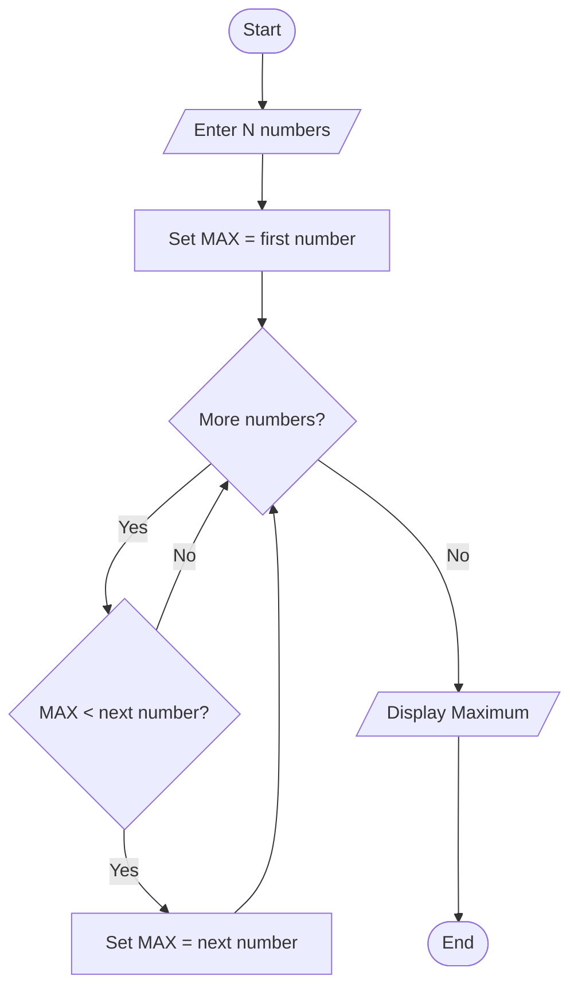

# Find Maximum of Three Numbers

## Problem Statement
Create a program that takes three numbers as input and finds the maximum (largest) among them.

## Flowchart



## Alternative Flowchart (Using Nested Logic)



## Pseudocode

```
BEGIN
    DECLARE num1, num2, num3, maximum

    DISPLAY "Enter first number: "
    READ num1

    DISPLAY "Enter second number: "
    READ num2

    DISPLAY "Enter third number: "
    READ num3

    // Assume first number is maximum initially
    SET maximum = num1

    // Compare with second number
    IF maximum < num2 THEN
        SET maximum = num2
    END IF

    // Compare with third number
    IF maximum < num3 THEN
        SET maximum = num3
    END IF

    // Display the result
    DISPLAY "The maximum number is: " + maximum

END
```

## Alternative Pseudocode (Using Multiple Comparisons)

```
BEGIN
    DECLARE a, b, c, max

    DISPLAY "Enter three numbers: "
    READ a, b, c

    // Method 1: Nested comparisons
    IF a >= b THEN
        IF a >= c THEN
            SET max = a
        ELSE
            SET max = c
        END IF
    ELSE
        IF b >= c THEN
            SET max = b
        ELSE
            SET max = c
        END IF
    END IF

    DISPLAY "Maximum is: " + max

END
```

## Function-based Pseudocode

```
Function FindMaximum(num1, num2, num3)
    DECLARE max

    // Initialize max with first number
    SET max = num1

    // Compare and update with other numbers
    IF num2 > max THEN
        SET max = num2
    END IF

    IF num3 > max THEN
        SET max = num3
    END IF

    RETURN max
End Function

// Main program
Start Program
    DECLARE x, y, z, result

    DISPLAY "Enter three numbers:"
    READ x, y, z

    SET result = FindMaximum(x, y, z)

    DISPLAY "The largest number is: " + result

End Program
```

## Step-by-Step Explanation

1. **Start**: Program execution begins
2. **Input Collection**: Get three numbers from the user (A, B, C)
3. **Comparison Logic**:
   - Compare A with B
   - If A >= B, then compare A with C
   - If A >= C, then A is maximum
   - If A < C, then C is maximum
   - If A < B, then compare B with C
   - If B >= C, then B is maximum
   - If B < C, then C is maximum
4. **Output**: Display the maximum number
5. **End**: Program terminates

## Variables Used

| Variable | Data Type | Purpose |
|----------|-----------|---------|
| num1, num2, num3 | Number | Store the three input numbers |
| maximum/max | Number | Store the largest number found |

## Comparison Algorithms

### Method 1: Sequential Comparison
```
Start with first number as maximum
Compare with second number, update if larger
Compare with third number, update if larger
```

### Method 2: Nested Decision Tree
```
Compare A vs B:
  If A >= B:
    Compare A vs C:
      If A >= C: Max = A
      Else: Max = C
  Else:
    Compare B vs C:
      If B >= C: Max = B
      Else: Max = C
```

## Sample Input/Output

**Input 1:**
```
Enter first number: 15
Enter second number: 27
Enter third number: 18
```

**Output 1:**
```
The maximum number is: 27
```

**Input 2:**
```
Enter first number: 42
Enter second number: 17
Enter third number: 93
```

**Output 2:**
```
The maximum number is: 93
```

## Edge Cases to Consider

- **Equal numbers**: When two or more numbers are equal
  - Example: 5, 5, 3 → Maximum is 5
- **Negative numbers**: Should handle negative values correctly
  - Example: -5, -2, -8 → Maximum is -2
- **Decimal numbers**: Should handle floating-point numbers
  - Example: 3.14, 2.71, 1.41 → Maximum is 3.14
- **Zero values**: Should handle zero as valid input
- **Large numbers**: Should handle very large numbers within language limits

## Manual Comparison Examples

**Example 1:** 15, 27, 18
```
15 vs 27: 27 is larger
27 vs 18: 27 is larger
Maximum: 27
```

**Example 2:** 42, 17, 93
```
42 vs 17: 42 is larger
42 vs 93: 93 is larger
Maximum: 93
```

**Example 3:** -5, -2, -8
```
-5 vs -2: -2 is larger
-2 vs -8: -2 is larger
Maximum: -2
```

## Implementation Notes

- **Initialization**: Start by assuming first number is maximum
- **Comparison operators**: Use appropriate comparison for data type
- **Multiple updates**: Maximum can be updated multiple times during comparison
- **Return value**: Function should return the maximum value found
- **Display format**: Format output clearly for user understanding

## Common Applications

- **Data analysis**: Finding highest value in a dataset
- **Game development**: Determining winner scores
- **Statistics**: Finding maximum in sample data
- **Sorting algorithms**: Building block for more complex sorting
- **Decision making**: Choosing the best option from multiple choices

## Extended Versions

**Find maximum of N numbers:**


## Performance Considerations

- **Time complexity**: O(1) - constant time for 3 numbers
- **Space complexity**: O(1) - uses fixed amount of memory
- **Comparison count**: Maximum 2 comparisons needed
- **Scalability**: Algorithm works efficiently for any number of inputs

## Testing Recommendations

Test with various input combinations:
- All positive numbers
- All negative numbers
- Mixed positive and negative
- Numbers with decimals
- Equal values
- Zero values
- Very large and very small numbers
