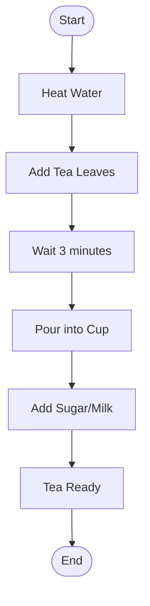
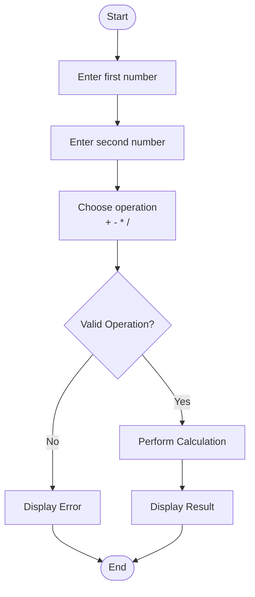
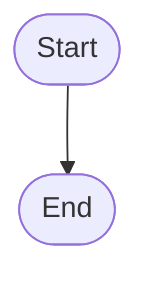
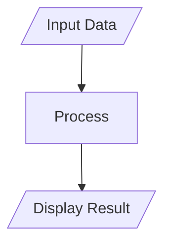
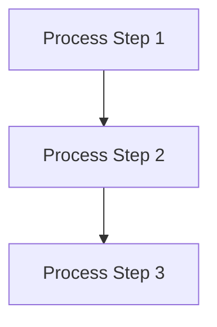
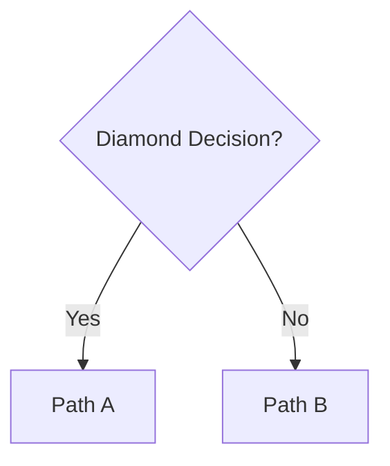
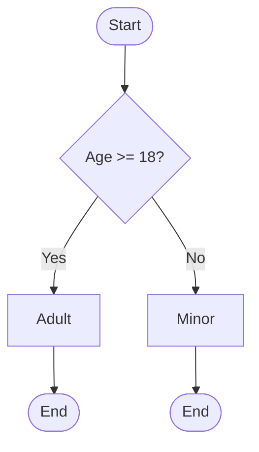
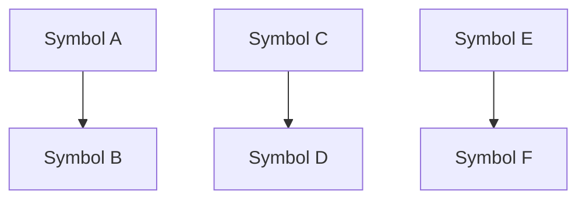

# Flowcharts & Diagram

**Flowcharts** are visual diagrams that represent solutions to problems using standardized symbols and connecting arrows to show the flow of logic and processes.

## Example 01: Making Tea

## Example 02: Simple Calculator

# Components

## Start / Exit

## Input / Output

## Process

## Decision

## Complex Decision Example

## Flow Lines (Arrows)

## Best Practices

1. **Flow Direction**: Always flow from top to bottom, left to right when possible
2. **Decision Clarity**: Decision diamonds should have clear Yes/No or True/False paths with descriptive labels
3. **Consistent Symbols**: Use standard shapes consistently throughout the diagram
4. **Clear Labels**: All symbols should have meaningful, descriptive labels that clearly explain their purpose
5. **Logical Grouping**: Related operations should be visually grouped together using subgraphs when possible
6. **Arrow Usage**: Use arrows consistently to show clear flow direction and avoid confusion

## Common Mistakes to Avoid

- Crossing flow lines unnecessarily (creates visual confusion)
- Using non-standard or inconsistent symbols
- Unclear or missing labels on symbols
- Creating infinite loops without clear exit conditions
- Making overly complex diagrams (break large processes into smaller, manageable sub-processes)
- Poor use of whitespace and alignment
- Unclear decision branches without proper labeling

## Standard Symbol Reference

| Symbol Shape | Name | Purpose |
|-------------|------|---------|
| Oval | Start/End | Beginning or end of process |
| Rectangle | Process | Processing, calculation, or action step |
| Diamond | Decision | Yes/No question or conditional branch |
| Parallelogram | Input/Output | Data input or output operation |
| Arrow | Flow Line | Direction of process flow |

## Tips for Effective Flowcharts

- **Keep it simple**: Complex flowcharts are hard to read and understand
- **Use consistent styling**: Same shapes, colors, and fonts throughout
- **Test your logic**: Trace through the flowchart to ensure it handles all cases
- **Consider your audience**: Use appropriate level of detail for the intended readers
- **Document assumptions**: Note any preconditions or assumptions in the flowchart
- **Use Mermaid**: Leverage Mermaid syntax for clean, maintainable diagrams in markdown files

## Mermaid Syntax Reference

**Basic Shapes:**
- `Node` - Rectangle (default)
- `Node([Label])` - Rounded rectangle
- `Node([Label])` - Oval for Start/End
- `Node[/Label/]` - Parallelogram for Input/Output
- `Node{Label}` - Diamond for decisions

**Connections:**
- `A --> B` - Arrow from A to B
- `A --- B` - Line without arrow
- `A -->|Label| B` - Arrow with label

**Flow Direction:**
- `flowchart TD` - Top to Down
- `flowchart LR` - Left to Right
- `flowchart BT` - Bottom to Top
- `flowchart RL` - Right to Left
