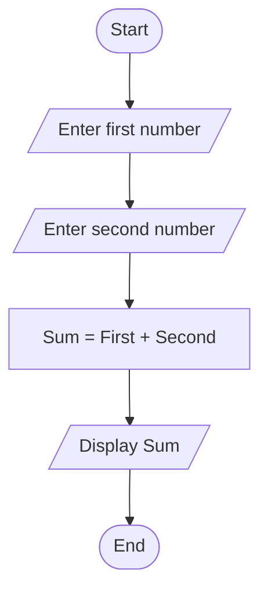

# Sum of Two Numbers

## Problem Statement
Create a program that takes two numbers as input, calculates their sum, and displays the result.

## Flowchart



## Pseudocode

```
BEGIN
    DECLARE firstNumber, secondNumber, sum

    DISPLAY "Enter first number: "
    READ firstNumber

    DISPLAY "Enter second number: "
    READ secondNumber

    SET sum = firstNumber + secondNumber

    DISPLAY "The sum is: "
    DISPLAY sum

END
```

## Alternative Pseudocode (More Structured)

```
Function AddTwoNumbers()
    // Input phase
    Read firstNumber from user
    Read secondNumber from user

    // Processing phase
    Calculate sum = firstNumber + secondNumber

    // Output phase
    Display sum to user

    Return sum
End Function

// Main program
Start Program
    Call AddTwoNumbers()
End Program
```

## Step-by-Step Explanation

1. **Start**: Program execution begins
2. **Input**: Get two numbers from the user
3. **Process**: Add the two numbers together
4. **Output**: Display the calculated sum
5. **End**: Program terminates

## Variables Used

| Variable | Data Type | Purpose |
|----------|-----------|---------|
| firstNumber | Number | Stores the first input value |
| secondNumber | Number | Stores the second input value |
| sum | Number | Stores the result of addition |

## Sample Input/Output

**Input:**
```
Enter first number: 15
Enter second number: 27
```

**Output:**
```
The sum is: 42
```

## Edge Cases to Consider

- **Negative numbers**: Should handle negative inputs correctly
- **Zero values**: Should handle zero as valid input
- **Decimal numbers**: Should handle floating-point arithmetic
- **Large numbers**: Should handle numbers within language limits

## Implementation Notes

- Use appropriate data types for input validation
- Consider adding input validation for non-numeric inputs
- Handle potential overflow for very large numbers
- Format output appropriately for currency or precision requirements
