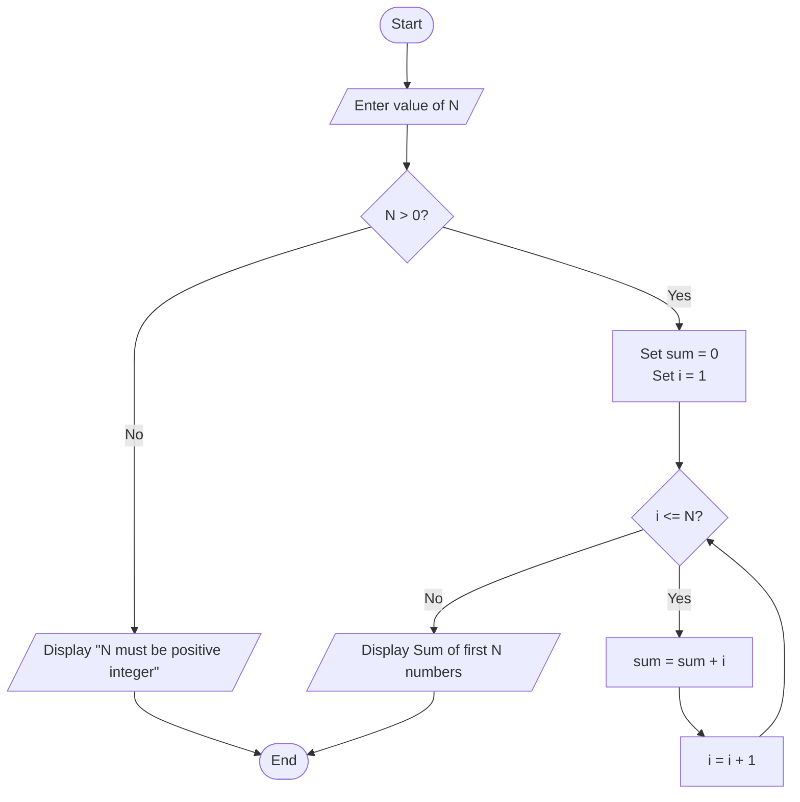

# Sum of First N Natural Numbers

## Problem Statement
Create a program that calculates the sum of the first N natural numbers, where N is a positive integer provided by the user. Natural numbers are positive integers starting from 1 (1, 2, 3, 4, ...).

## Mathematical Formula
**Sum = N × (N + 1) / 2**

This is also known as the **triangular number** formula.

## Flowchart (Using Formula)

```mermaid
flowchart TD
    Start([Start]) --> InputN[/Enter value of N/]
    InputN --> ValidateN{N > 0?}

    ValidateN -->|No| DisplayError[/Display "N must be positive integer"/]
    DisplayError --> End([End])

    ValidateN -->|Yes| CalculateSum[Sum = N × (N + 1) / 2]
    CalculateSum --> DisplayResult[/Display Sum of first N numbers/]
    DisplayResult --> End([End])
```

## Flowchart (Using Loop)



## Pseudocode (Using Formula)

```
BEGIN
    DECLARE n, sum

    DISPLAY "Enter a positive integer N: "
    READ n

    IF n <= 0 THEN
        DISPLAY "Error: N must be a positive integer"
    ELSE
        // Using mathematical formula
        SET sum = n * (n + 1) / 2

        DISPLAY "Sum of first " + n + " natural numbers is: " + sum
    END IF

END
```

## Pseudocode (Using Loop)

```
BEGIN
    DECLARE n, sum, i

    DISPLAY "Enter a positive integer N: "
    READ n

    IF n <= 0 THEN
        DISPLAY "Error: N must be a positive integer"
    ELSE
        // Initialize sum
        SET sum = 0
        SET i = 1

        // Loop to calculate sum
        WHILE i <= n DO
            SET sum = sum + i
            SET i = i + 1
        END WHILE

        DISPLAY "Sum of first " + n + " natural numbers is: " + sum
    END IF

END
```

## Pseudocode (Using For Loop)

```
BEGIN
    DECLARE n, sum, i

    DISPLAY "Enter a positive integer N: "
    READ n

    IF n <= 0 THEN
        DISPLAY "Error: N must be a positive integer"
    ELSE
        SET sum = 0

        // For loop to calculate sum
        FOR i = 1 TO n DO
            SET sum = sum + i
        END FOR

        DISPLAY "Sum of first " + n + " natural numbers is: " + sum
    END IF

END
```

## Function-based Pseudocode

```
Function CalculateSumFormula(n)
    // Using mathematical formula - Most efficient
    IF n <= 0 THEN
        RETURN "Error: N must be positive"
    END IF

    DECLARE sum = n * (n + 1) / 2
    RETURN sum
End Function

Function CalculateSumLoop(n)
    // Using loop - Educational but less efficient
    IF n <= 0 THEN
        RETURN "Error: N must be positive"
    END IF

    DECLARE sum = 0
    DECLARE i = 1

    WHILE i <= n DO
        SET sum = sum + i
        SET i = i + 1
    END WHILE

    RETURN sum
End Function

Function CalculateSumRecursive(n)
    // Using recursion - Elegant but can cause stack overflow for large n
    IF n <= 0 THEN
        RETURN 0
    END IF

    IF n == 1 THEN
        RETURN 1
    ELSE
        RETURN n + CalculateSumRecursive(n - 1)
    END IF
End Function

// Main program
Start Program
    DECLARE num, result

    DISPLAY "Enter a positive integer N:"
    READ num

    // Choose any of the three methods:

    // Method 1: Formula (Recommended)
    SET result = CalculateSumFormula(num)

    // Method 2: Loop
    // SET result = CalculateSumLoop(num)

    // Method 3: Recursive
    // SET result = CalculateSumRecursive(num)

    IF result is a number THEN
        DISPLAY "Sum of first " + num + " natural numbers is: " + result
    ELSE
        DISPLAY result  // Display error message
    END IF

End Program
```

## Step-by-Step Explanation

### Method 1: Mathematical Formula (Most Efficient)
1. **Start**: Program execution begins
2. **Input**: Get value of N from user
3. **Validation**: Check if N is positive
4. **Calculation**: Use formula **Sum = N × (N + 1) / 2**
5. **Output**: Display the calculated sum
6. **End**: Program terminates

### Method 2: Loop-based Approach
1. **Start**: Program execution begins
2. **Input**: Get value of N from user
3. **Validation**: Check if N is positive
4. **Initialization**: Set sum = 0, i = 1
5. **Loop**: Add each number from 1 to N to sum
6. **Output**: Display the calculated sum
7. **End**: Program terminates

## Variables Used

| Variable | Data Type | Purpose |
|----------|-----------|---------|
| n/num | Integer | The upper limit for natural numbers to sum |
| sum/result | Integer | Stores the calculated sum |
| i | Integer | Loop counter variable |

## Calculation Methods Comparison

| Method | Time Complexity | Space Complexity | Best For |
|--------|----------------|------------------|----------|
| Formula | O(1) | O(1) | Large values of N |
| Loop | O(N) | O(1) | Small to medium N |
| Recursive | O(N) | O(N) | Understanding recursion |

## Sample Input/Output

**Input 1:**
```
Enter a positive integer N: 5
```

**Output 1:**
```
Sum of first 5 natural numbers is: 15
```

**Input 2:**
```
Enter a positive integer N: 10
```

**Output 2:**
```
Sum of first 10 natural numbers is: 55
```

**Input 3:**
```
Enter a positive integer N: 100
```

**Output 3:**
```
Sum of first 100 natural numbers is: 5050
```

## Manual Calculation Verification

**For N = 5:**
```
1 + 2 + 3 + 4 + 5 = 15
Formula: 5 × (5 + 1) / 2 = 5 × 6 / 2 = 30 / 2 = 15 ✓
```

**For N = 10:**
```
1 + 2 + 3 + 4 + 5 + 6 + 7 + 8 + 9 + 10 = 55
Formula: 10 × (10 + 1) / 2 = 10 × 11 / 2 = 110 / 2 = 55 ✓
```

**For N = 100:**
```
Formula: 100 × (100 + 1) / 2 = 100 × 101 / 2 = 10100 / 2 = 5050 ✓
```

## Triangular Numbers

The sum of first N natural numbers produces triangular numbers:

| N | Sum | Visual Representation |
|---|-----|----------------------|
| 1 | 1 | ● |
| 2 | 3 | ●<br/>● ● |
| 3 | 6 | ●<br/>● ●<br/>● ● ● |
| 4 | 10 | ●<br/>● ●<br/>● ● ●<br/>● ● ● ● |
| 5 | 15 | ●<br/>● ●<br/>● ● ●<br/>● ● ● ●<br/>● ● ● ● ● |

## Edge Cases to Consider

- **N = 1**: Sum should be 1
- **N = 0**: Mathematically 0, but typically considered invalid input
- **Negative numbers**: Should display error message
- **Very large N**: Should handle large numbers (consider BigInteger)
- **Non-integer input**: Should handle validation

## Performance Comparison

### Formula Method (Recommended)
- **Pros**: Instant calculation, no loops, works for any N
- **Cons**: None significant
- **Use when**: N can be very large

### Loop Method
- **Pros**: Easy to understand, shows the addition process
- **Cons**: Slower for large N, more code
- **Use when**: N is small or for educational purposes

### Recursive Method
- **Pros**: Elegant, mathematical concept
- **Cons**: Stack overflow for large N, uses more memory
- **Use when**: N is small and recursion is acceptable

## Implementation Notes

- **Input validation**: Always check for positive integers
- **Data types**: Use appropriate integer types to handle large sums
- **Division**: Ensure proper handling of integer division
- **Large numbers**: Consider using BigInteger for very large N
- **User experience**: Provide clear prompts and error messages

## Common Applications

- **Mathematics**: Triangular number calculations
- **Statistics**: Sum of arithmetic series
- **Physics**: Distance calculations under constant acceleration
- **Computer Science**: Algorithm analysis, loop optimization
- **Finance**: Compound interest calculations
- **Gaming**: Score calculations, level progression

## Extended Versions

**Sum of first N even natural numbers:**
```
Sum = N × (N + 1)
```

**Sum of first N odd natural numbers:**
```
Sum = N²
```

**Sum of squares of first N natural numbers:**
```
Sum = N × (N + 1) × (2N + 1) / 6
```

## Testing Recommendations

Test with various values:
- Small values (1, 2, 3, 5, 10)
- Medium values (50, 100, 500)
- Large values (1000, 10000, 100000)
- Edge cases (0, negative numbers)
- Boundary values (1, 2)

## Historical Note

The formula for the sum of natural numbers was known to ancient mathematicians:
- **Gauss legend**: As a child, Carl Friedrich Gauss quickly calculated the sum of numbers from 1 to 100
- **Ancient India**: Used in Vedic mathematics
- **Greek mathematics**: Known to Archimedes and other mathematicians

## Time Complexity Analysis

- **Formula method**: O(1) - Constant time
- **Loop method**: O(N) - Linear time
- **Recursive method**: O(N) - Linear time (with O(N) space)

For most practical purposes, the formula method is recommended due to its efficiency and simplicity.
