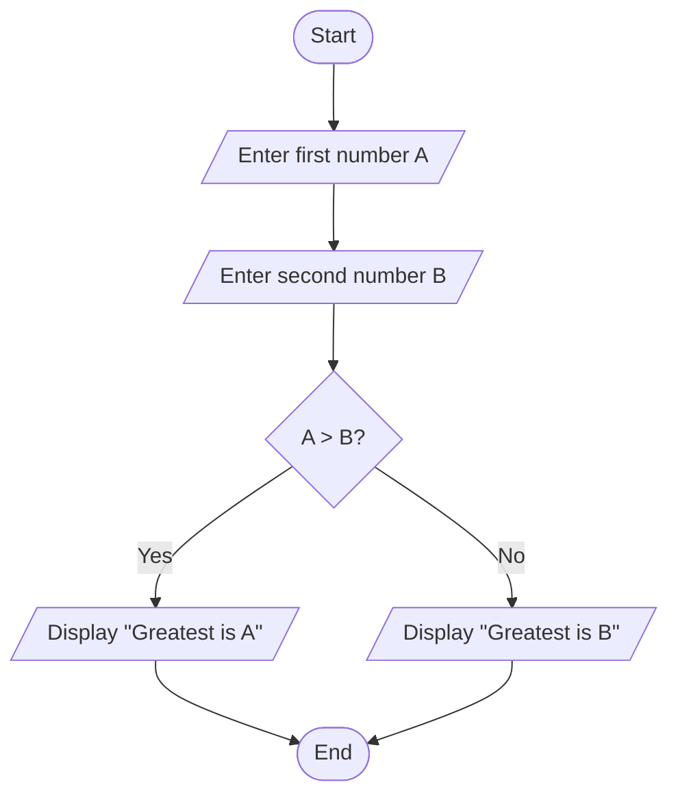

# Flowchart Practice Problems

## Question 1: Flowchart to calculate the area of a circle

**Problem Statement:** Create a flowchart to calculate the area of a circle given its radius.

**Formula:** Area = π × r² (where π ≈ 3.14159)


## Question 2: Flowchart to find the greatest from 2 numbers

**Problem Statement:** Create a flowchart to find the greatest number between two given numbers.



## Question 3: Flowchart to print the Even numbers between 9 and 100

**Problem Statement:** Create a flowchart to display all even numbers between 9 and 100 (inclusive).

```mermaid
flowchart TD
    Start([Start]) --> Initialize[Set num = 10<br/>(First even number > 9)/]

    Initialize --> CheckRange{num <= 100?}

    CheckRange -->|Yes| DisplayNum[/Display num/]
    DisplayNum --> Increment[Set num = num + 2]
    Increment --> CheckRange

    CheckRange -->|No| End([End])
```

## Question 4: Flowchart for calculating the average from 25 exam scores

**Problem Statement:** Create a flowchart to calculate the average of 25 exam scores entered by the user.


---

# Additional Practice Problems

## Question 5: Flowchart to check if a number is positive, negative, or zero


## Question 6: Flowchart to calculate factorial of a number


## Question 7: Flowchart to convert temperature from Celsius to Fahrenheit

```mermaid
flowchart TD
    Start([Start]) --> InputCelsius[/Enter temperature in Celsius/]
    InputCelsius --> Convert[Fahrenheit = (Celsius × 9/5) + 32]
    Convert --> DisplayResult[/Display Temperature in Fahrenheit/]
    DisplayResult --> End([End])
```

## Question 8: Flowchart to check if a year is a leap year


## Question 9: Flowchart to generate multiplication table


## Question 10: Flowchart to reverse a given number

```mermaid
flowchart TD
    Start([Start]) --> InputNum[/Enter number to reverse/]
    InputNum --> InitReverse[Set reverse = 0<br/>Store original number/]

    InitReverse --> ExtractDigit{original > 0?}

    ExtractDigit -->|Yes| GetLastDigit[digit = original % 10]
    GetLastDigit --> UpdateReverse[reverse = (reverse × 10) + digit]
    UpdateReverse --> RemoveLastDigit[original = original / 10]
    RemoveLastDigit --> ExtractDigit

    ExtractDigit -->|No| DisplayReverse[/Display reversed number/]
    DisplayReverse --> End([End])
```

---

# Solutions and Explanations

## Question 1 Solution: Area of Circle
- **Input**: Radius (r)
- **Process**: Area = π × r²
- **Output**: Display calculated area
- **Edge Cases**: Radius must be positive

## Question 2 Solution: Greatest of Two Numbers
- **Input**: Two numbers (A, B)
- **Process**: Compare A and B
- **Output**: Display the larger number
- **Edge Cases**: Equal numbers (display either)

## Question 3 Solution: Even Numbers 9-100
- **Process**: Start from 10, add 2 each time until 100
- **Output**: Display all even numbers in range
- **Note**: 9 and 100 are odd, so excluded

## Question 4 Solution: Average of 25 Scores
- **Input**: 25 exam scores
- **Process**: Sum all scores and divide by 25
- **Output**: Display average score
- **Edge Cases**: Validate score range (0-100)

## Tips for Creating Flowcharts

1. **Start with clear problem statement**
2. **Identify inputs and outputs**
3. **Break down the logic into steps**
4. **Use appropriate symbols**:
   - Oval: Start/End
   - Parallelogram: Input/Output
   - Rectangle: Process
   - Diamond: Decision
5. **Test your flowchart logic**
6. **Keep it simple and readable**

## Common Flowchart Patterns

- **Sequential**: Step-by-step processes
- **Decision**: If-else branching
- **Loops**: Repetitive operations
- **Input/Output**: Data entry and display

Practice these problems to improve your flowchart design skills and algorithmic thinking!
